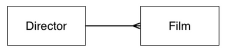
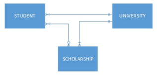

# LS181 Spot Questions
https://fine-ocean-68c.notion.site/LS180-906a0630d9d04f43803f149fd91196f0?p=2a398057ddd4464faa19b2eb82f7df52&pm=s

---

1
Consider the last line of the following code. Will the code result in an error if we attempt to insert NULL value to a student_id column? Why or why not?
```sql
CREATE TABLE students (
	id serial PRIMARY KEY,
	name text
);

CREATE TABLE classes (
	id serial PRIMARY KEY,
	name text,
	student_id int FOREIGN KEY REFERENCES students (id)
);

INSERT INTO students (name) VALUES ('Johny'), ('Edd');
INSERT INTO classes (name, student_d) 
  VALUES ('Math', 1), ('Art', NULL), ('Geography', 1));
```

- Assume the last `INSERT INTO` statement was intending to insert into the 'student_id' column and not the 'student_d' column
  - Otherwise, there would be an error indicating that the 'student_d' column does not exist
- There will not be an error if we attempt to insert a NULL value into 'student_id' - this is because the 'student_id' column does not have a 'NOT NULL' constraint on it

---

2
Consider the code below. How are relations, tuples, attributes, and entities represented in the example below? 
```sql
CREATE TABLE teachers (
	id serial PRIMARY KEY,
	name text,
);

CREATE TABLE classes (
	id serial PRIMARY KEY,
	name text,
	teacher_id int REFERENCES teaachers (id) 
		ON DELETE CASCADE
);

INSERT INTO teachers (name) VALUES ('Marry Bee');
INSERT INTO classes (name, teacher_id) VALUES ('Math', 1);
```

- The relations are the tables 'teachers' and 'classes'. 
- The higher-order, conceptual *entities* are a list of teachers, and a list of classes (with a corresponding teacher).
- The attributes are the various columns of data that have been defined for each table.
  - For 'teachers', the attributes are an 'id' and a 'name'.
  - For 'classes', the attributes are and 'id', a 'name', and a 'teacher_id'.
- A tuple is a row of data, which for the 'teachers' table would be comprised of a value for each of the attributes of that table: a unique 'id' and the name of a teacher, e.g., (3, 'Mrs. Jackson').  For the 'classes' table, a tuple might be (3, 'RB129', 3).

---

3
Consider the code below. How is a relation represented on the code below? How is a relationship represented? 
```sql
CREATE TABLE teachers (
	id serial PRIMARY KEY,
	name text,
);

CREATE TABLE classes (
	id serial PRIMARY KEY,
	name text,
	teacher_id int REFERENCES teachers (id) 
		ON DELETE CASCADE
);
```

- Relations are tables.  Thus, in the code, the relations are defined through the `CREATE TABLE` statements - 1 for the table 'teachers' and 1 for the table 'classes'.  For each table, the various column (field) names have been identified, along with the respective data types and any constraints placed on the columns or table.

- A relationship has been established the table 'teachers' and the table 'classes' via the 'FOREIGN KEY' constraint (the 'REFERENCES' condition in table 'classes', assigned to the column 'teacher_id'). This identifies the 'teacher_id' column as containing integers which represent the primary keys of the table 'teachers'.  For this particular foreign key constraint, an additional option 'ON DELETE CASCADE' has been applied which indicates that should the referenced value in 'teachers.id' be deleted, the referencing row in 'classes' should also be deleted.

---

4
Considering the following code explain how do defining keys and constraints ensure data integrity?
```sql
CREATE TABLE teachers (
	id serial PRIMARY KEY,
	name text,
);

CREATE TABLE classes (
	id serial PRIMARY KEY,
	name text,
	teacher_id int REFERENCES teaachers (id) 
		ON DELETE CASCADE
);
```

- Assume that the foreign key definition references the table 'teachers' and not 'teaachers', otherwise, an error will be thrown.

- Defining a primary key on table 'teachers' ensures that there is a unique (not null) identifier for each row of data within the table. Since this identifier is unique, it can be used to identify each row of data unambiguously.
- The foreign key defined on table 'classes' references that unambiguous identifer. Being defined as a foreign key, the database will ensure that any value assigned to the 'teacher_id' column exists as a value within the 'teachers' table in the 'id' column. If an assigned value does not exist, postgresql will throw an error.  This 'checking' of values assigned to 'teacher_id' allows the database to maintain the integrity of it's data, in particular the integrity of the references.  Hence, the name 'referential integrity'.

---

5
Explain how this SELECT query will be executed?
```sql
SELECT teachers.name, 
	FROM teachers
		JOIN classes
			ON teachers.id = classes.teacher_id
				GROUP BY teachers.name
					ORDER BY COUNT(classes.id);
```

- Assume that the initial comma after teachers.name is a TYPO, otherwise there will be an error returned.

- First, the 'FROM' and 'JOIN' tables are combined into 1 combined virtual, temporary table (based on the ON clause)
- Then, the 'GROUP BY' is applied to create groups of rows
- Then, the 'ORDER BY' is applied to reorder the groups / rows
- Then the required fields (columns) are gathered 

---

6
Consider the code below: What are the different data types in this example. Describe each of them and describe the differences between them.
```sql
CREATE TABLE example (
	id serial PRIMARY KEY,
	title varchar(200) NOT NULL UNIQUE,
	name char(100), 
	age numeric NOT NULL
);
```

- **serial** : this data type is a sequence of integers, starting with 1, which auto-increment using an SQL 'sequence' such that the same number is never returned twice by the sequence.  This ensure that the values within the 'id' column will be unique.
- **numeric** : this data type is a decimal number of varying precision (i.e., a precison / scale were not defined). This differs from integers - integers have no decimal places, but numeric can have up to 16383 digits after the decimal place (PostgreSQL v12).
- **varchar(200**) : 'varchar' is a variable character string which will be as many characters as necessary up to the parameter value (200 characters, in this case). Different row may have different lengths for the data in the title field, depending on the title.
- **char(100)** : 'char' is a character string which is always a fixed length, as defined by the parameter value (100 characters, in this case). In the event the string within the field is less than 100 characters, padding spaces are added to ensure the length of the string is 100.


---

7
Consider the code below:
```sql
CREATE TABLE example(
	some_num numeric(10,2)
);

INSERT INTO example (some_num) VALUES (1);
```
Will this code raise an error? Why or why not?

- This code does not raise an error since the value inserted into the table 'example' can be readily cast into the defined data type (numeric with 10 digits total of which 2 are decimal places) - i.e., 1 = 1.00.

---

8
Consider the code below:
```sql
CREATE TABLE example(
	some_num int,
	some_text text CHECK (some_text > 0)
);

INSERT INTO example (some_num)
	VALUES (11);
```
Will this code raise an error? Why or why not?

- This code will return an error since it is not possible to compare the 'text' data type with '> 0' (an integer).  PostgreSQL indicates that an operator does not exist to compare 'text > integer'.

---

9
What will the following code return and why?
```sql
SELECT NULL IS NOT NULL;
```

- This code will return an unnamed column ('?column?') with a row value of 'f' for false (since NULL IS NULL).

---

10
Consider the code below. Will this code raise an error? Why or why not?
```sql
CREATE TABLE some_table (
	some_num decimal(10,4) DEFAULT 'some text'
	some_t_or_f boolean DEFAULT true
);
```

- Assume that a comma is supposed to come after 'some text'.  Otherwise, a syntax error will be raised.

- This code will raise an error since the default value given ('some text') is a string and not a decimal value as per the data type defined for the 'some_num' column. PostgreSQL will raise an error if the default cannot be readily cast into the data type of the column (i.e., if the column is 'text', then a number given as a default will be cast to text automatically).

---

11
Consider the code below:
```sql
CREATE TABLE some_table(
	some_num decimal(10,4),
	some_t_or_f boolean DEFAULT true
);

INSERT INTO some_table (some_num, some_t_or_f)
	VALUES (11, NULL);
```
What values will be inserted into the table?

- The value inserted for 'some_num' will be 11 and the value inserted for 'some_t_or_f' will be 'true', since the default value for the column is defined as true and no value is given within the `INSERT` statement.

---

12
Consider the following code. What does ON DELETE CASCADE do in this example?
```sql
CREATE TABLE teachers (
	id serial PRIMARY KEY,
	name text,
);

CREATE TABLE classes (
	id serial PRIMARY KEY,
	name text,
	teacher_id int REFERENCES teaachers (id) 
		ON DELETE CASCADE
);
```

- Assume that 'teacher_id' references the 'teachers' table and NOT 'teaachers' (since otherwise an error would be raised indicating the relation 'teaachers' does not exist)

- 'ON DELETE CASCADE' indicates that if the referenced row in the 'teachers' table is deleted, that the corresponding row in 'classes' will also be deleted.

---

13
Consider the following error message:
```
ERROR:  duplicate key value violates unique constraint "unique_id"
DETAIL:  Key (id)=(1) already exists.
```
When would PostgreSQL throw this error and why? Explain the information that this error message gives us.

- This error would be thrown when there is a unique constraint on the column "id" and data trying to be inserted into this column is the same as an existing value.
- This error tells us that there is a unique constraint with the name "unique_id" and that the value being inserted into the 'id' column was 1, and that the value 1 already exists within another row.

---

14
Create a table teachers with a column called set_up_date and set it to text. Change the data type in that column to a date data type.

```sql
CREATE TABLE teachers (
  set_up_date text
);

ALTER TABLE teachers ALTER COLUMN set_up_date TYPE date USING set_up_date::date;
```
- Note: the 'USING' clause was required by PostgreSQL to explicitly cast the string data type into a date

---

15
Consider the table below: What indexes does this table have and what type of algorithms has been used for the indexing? Explain how they have been created:
```sql
my_books=# CREATE TABLE authors (
my_books(#   id serial PRIMARY KEY,
my_books(#   name varchar(100) NOT NULL
my_books(# );
CREATE TABLE
my_books=# CREATE TABLE books (
my_books(#   id serial PRIMARY KEY,
my_books(#   title varchar(100) NOT NULL,
my_books(#   isbn char(13) UNIQUE NOT NULL,
my_books(#   author_id int REFERENCES authors(id)
my_books(# );

CREATE TABLE
my_books=# \d books
Table "public.books"
      Column     |          Type          |                     Modifiers
- ---------------+------------------------+----------------------------------------------------
  id             | integer                | not null default nextval('books_id_seq'::regclass)
  title          | character varying(100) | not null
  isbn           | character(13)          | not null
  author_id      | integer                |

Indexes:
"books_pkey" PRIMARY KEY, btree (id)
"books_isbn_key" UNIQUE CONSTRAINT, btree (isbn)
"books_author_id_idx" btree (author_id)

Foreign-key constraints:
"books_author_id_fkey" FOREIGN KEY (author_id) REFERENCES authors(id)
```

- In the 'authors' table, a PRIMARY KEY called 'id' has been created.
- In the 'books' table, a PRIMARY KEY called 'id' has been created,
  an index 'isbn' has been created by defining this field as 'NOT NULL UNIQUE', which is roughly equivalent to a primary key,
  an index 'author_id' has been created since this column has a FOREIGN KEY constraint and references a PRIMARY KEY, which means all data values will also be UNIQUE and NOT NULL.

---

16
If we create a table with an id column and specify it as serial, and we look at the schema of that table, what will be shown as a Type of id? Why? 

- Using 'serial' as a data type is equivalent to defining the data type as 'integer' with a 'NOT NULL' constraint and a default value defined by the next value in a sequence where each value increments by 1.

---

17
Consider the following code:
```sql
SELECT age, full_name FROM students
WHERE id < 2;
```
What type of statement is this code presenting? Explain all components of this statement. 

- The given statement is a type of SQL statement which is part of Data Manipulation Language (DML). This statement retrieves the actual data stored within the table 'students', in particular the columns (fields) 'age' and 'full_name'. The use of the 'WHERE' clause filters the returned rows to on those where the value in the 'id' column is less than 2.

---

18
Consider the code below:
```sql
SELECT year FROM schedule WHERE year > 2010;
```
Why will this code result in an error? Why or why not? 

- Depending on the data type of the column "year", this statement may or may not return an error.
- If the data type of "year" was integer, then the statement will not return an error, since the condition provided for the WHERE clause compares "year" to an integer.
- If the data type of "year" was defined as something else (for example, a 'date' type) then an error will be returned if PostgreSQL cannot evaluate the condition 'year > 2010'.

---

19
Consider the code below:
```sql
SELECT full_name FROM students WHERE full_name ILIKE '%Johanson';
```
Will this result in an error? Why or why not? If not what will be the output of that code?

- Assuming that column 'full_name' was defined with a string data type, the provided statement will not result in an error.
- The condition 'full_name ILIKE' will return all rows where the 'full_name' column matches the provided string in a case-insensitive fashion. 
- The string provided in the condition, '%Johanson', contains a wildcard '%' which indicates any number of any characters. In the example provided the use of the wildcard before 'Johanson' indicates any number of any character before the string 'Johanson'.  Thus, the returned values for the 'full_name' column would be any values in the table including possibilities such as: 'johanson', 'aJOHANSON', '3jOhAnsOn', 'd#fadfjohanson'.

---

20
Consider the code below:
```sql
SELECT full_name FROM students WHERE full_name ILIKE '%Johanson';
```
Which of the following names would be returned and why?
- Johanson : assuming this is a string it would be returned since it has 0 characters before 'Johanson' and matches (case-insensitive) to 'Johanson'
- 'Johanson Branson' : this would NOT match since there are additional characters AFTER 'Johanson'
- 'Eva B. Johanson' : this WOULD match since there are any number of characters BEFORE 'Johanson'
- 'johanson' : this WOULD match since it has 0 characters before 'Johanson' and matches (case-insensitive) to 'Johanson'

---

21
Consider the students table below: 
```sql
name   |   age   |   participated
---------------------------------
'Ann'  |   13    |   t
'Ben'  |   12    |   
'Emma' |   15    |   f
'Kat'  |   12    |   f
```
Write a query that retrieves all the names of kids for whom the value of participated column is not true. 

- The required condition for the WHERE clause needs to account for both 'false' and NULL values:
`SELECT name FROM students WHERE (participated IS NULL OR participated = false);`

---

22
Consider the error message below:
```sql
ERROR:  column "users.full_name" must appear in the GROUP BY clause or be used in an aggregate function
```
What does this error message tell us? Write a statement that could cause an error like that and describe ways to resolve this error. 

- This error indicates that a query has been defined where the resulting rows are being 'grouped' in some way and PostgreSQL has not been explicitly told how to aggregate the results from the column 'full_name' in the table 'users'.
- An example of this might occur if there was a table 'users' which contains the same data as in question #21 above (renaming the 'name' column to 'full_name'). With such a data set, we would get the same error if we ran this query:
`SELECT users.full_name, age FROM users GROUP BY age;`
- To fix this error, we must explicitly tell PostgreSQL how to aggregate the various string names which have the same age by updating the query to:
`SELECT string_agg(users.full_name, ', '), age FROM users GROUP BY age;`

---

23
Consider a students table below: 
```sql
id |    name    |    year_of_birth    |    grade
-------------------------------------------------
1  |  'Eddie'   |   1986-01-01        |   A
2  |  'Maggie'  |   1975-04-11        |   B+
3  |  'Elenore' |   1995-03-13        |   A-
```
- Write a query that returns names of students who were born in April
  - `SELECT name FROM students WHERE date_part('month', year_of_birth) = 4;`

- Write a query that returns names of students who were born on 11th of April
  - `SELECT name FROM students WHERE date_part('month', year_of_birth) = 4 AND date_part('day', year_of_birth) = 11;`

- Write a query that returns all students who were born in 1986
  - `SELECT name FROM students WHERE date_part('year', year_of_birth) = 1986;`

- Write a query that returns the oldest person
  - `SELECT name FROM students WHERE year_of_birth = (SELECT min(year_of_birth) FROM students);`
  - `SELECT name FROM students ORDER BY year_of_birth ASC LIMIT 1;`

---

24
What syntax would you use to remove all rows from an imaginative students table? Present a code that illustrates that.

- `DELETE FROM students;`

---

25
Why do we need to create multiple tables instead of just keeping all the data in one table? 

- When data is duplicated within a single table, then it should be moved to a separate table.  Otherwise, there is potential for a number of database anomalies. One such anomaly is having an inconsistent database, where the database might have more than 1 answer for a given question. Other anomalies include update anomalies (where updating a row creates an inconsistent database), insertion anomalies (where you cannot enter information about 1 thing without having to enter information about something else), and deletion anomalies (where by deleting 1 piece of information, you lose other information).

---

26
Consider the following students table: 
```sql
id |    name    |    year_of_birth    |    grade |  class
-----------------------------------------------------------
1  |  'Eddie'   |   1986-01-01        |   A      |  Math
2  |  'Maggie'  |   1975-04-11        |   B+     |  History
3  |  'Elenore' |   1995-03-13        |   A-     |  French
```
- We no longer want to have classes at the same table as students. What are the steps you would take to create another table classes and create a relationship between students and classes. 
- Create classes table and the relationship between classes and students.

- Define a new table 'classes' which contains a primary key 'id' (serial integer) and a corresponding class 'name'.
- Insert the class data into the 'classes' table ('Math', 'History', 'French').
- Add a new column 'class_id' in table 'students'. Define this column as type integer, with a foreign key constraint which references the 'id' column of table 'classes'.
- Update the required data (the class id corresponding to the appropriate class name) into the new 'class_id' column.
- Delete the 'class' column from the 'students' table.
- If desired, add a 'NOT NULL' constraint on the 'class_id' column.

```sql
-- Create 'existing' students table (note, simplified to not include grade)
CREATE TABLE students (id serial, name text, year_of_birth date, class text);
INSERT INTO students (name, year_of_birth, class) VALUES
  ('Eddie', '1986-01-01','Math'),
  ('Maggie','1975-04-11','History'),
  ('Elenore','1995-03-13','French');

-- Create new tables
CREATE TABLE classes (id serial PRIMARY KEY, name text);
INSERT INTO classes (name) VALUES ('Math'), ('History'), ('French');

ALTER TABLE students ADD COLUMN class_id integer REFERENCES classes(id);
UPDATE students SET class_id = 1 WHERE class = 'Math';
UPDATE students SET class_id = 2 WHERE class = 'History';
UPDATE students SET class_id = 3 WHERE class = 'French';

ALTER TABLE students DROP COLUMN class;
ALTER TABLE students ALTER COLUMN class_id SET NOT NULL;
```

---

27
What benefits does presenting cardinality give us? How may the information that representing cardinality in our diagrams be useful for the database design?

- Cardinality indicates if a particular entity has a "many" relationship to another entity or a "1" relationship to another entity. This information is useful since it indicates what tables and attributes may be required.
- A many-to-many relationship will require an additional join table as part of the database table design, whereas a 1-to-many or 1-to-1 will not. 
- For a 1-to-many relationship, the "many" side of the relationship will be a foreign key (not unique) which points to a primary key of the other entity.
- For a 1-to-1 relationship, 1 entity will be a primary key and the second entity will be a foreign key referencing the primary key of the first entity. This same foreign key column will also be the primary key of the second entity.


---

28
Consider the ERD below. Describe the relationships between those entities:


- There are 2 entities: 'Director' and 'Film'.
- The relationship between the 2 entities is that for 1 'Director' there can be many 'Film's. For any given 'Film' there can be only 1 'Director'.

---

29
Consider the following diagrams. Describe what is the cardinality between entities?


- There are 3 entities: 'STUDENT', 'UNIVERSITY', 'SCHOLARSHIP'.
- Between 'STUDENT' and 'UNIVERSITY' there is M:1 relationship; for each 'STUDENT' there must be 1 'UNIVERSITY'; for each 'UNIVERSITY' there is at least 1 or many 'STUDENT's.
- Between 'STUDENT' and 'SCHOLARSHIP' there is a M:M relationship; for each student there MAY (optionally) be 1 or more 'SCHOLARSHIP's; for each 'SCHOLARSHIP' there is at least 1 or many 'STUDENT's.
- Between 'UNIVERSITY' and 'SCHOLARSHIP' there is a 1:M relationship; for each 'UNIVERSITY' there is at least 1 or more 'SCHOLARSHIP's; for each 'SCHOLARSHIP' there is 1 'UNIVERSITY'.

---

30
Consider two tables below: 
```sql
SELECT * FROM customers;
 customer_id | name  
-------------+-------
           1 | Johny
           2 | Ben
           3 | Gary

SELECT * FROM orders;
 order_id | customer_id | orders 
----------+-------------+--------
        1 |           1 | book
        2 |           2 | mug
        3 |           3 | chair

\d orders 

   Column    |  Type   | Collation | Nullable |                 Default                  
-------------+---------+-----------+----------+------------------------------------------
 order_id    | integer |           | not null | nextval('orders_order_id_seq'::regclass)
 customer_id | integer |           |          | 
 orders      | text    |           |          | 
Indexes:
    "orders_pkey" PRIMARY KEY, btree (order_id)
Foreign-key constraints:
    "orders_customer_id_fkey" FOREIGN KEY (customer_id) REFERENCES customers(customer_id)
```
What will happen if we run the following statement? Why? 
`DELETE FROM customers WHERE customer_id = 3;`

- An error will be raised since the 'customer_id' column is referenced by the foreign key constraint in the 'orders' table. Hence, deleting the customer with id = 3 without first deleting the row referencing that id in 'orders' would break 'referential integrity'.

---

